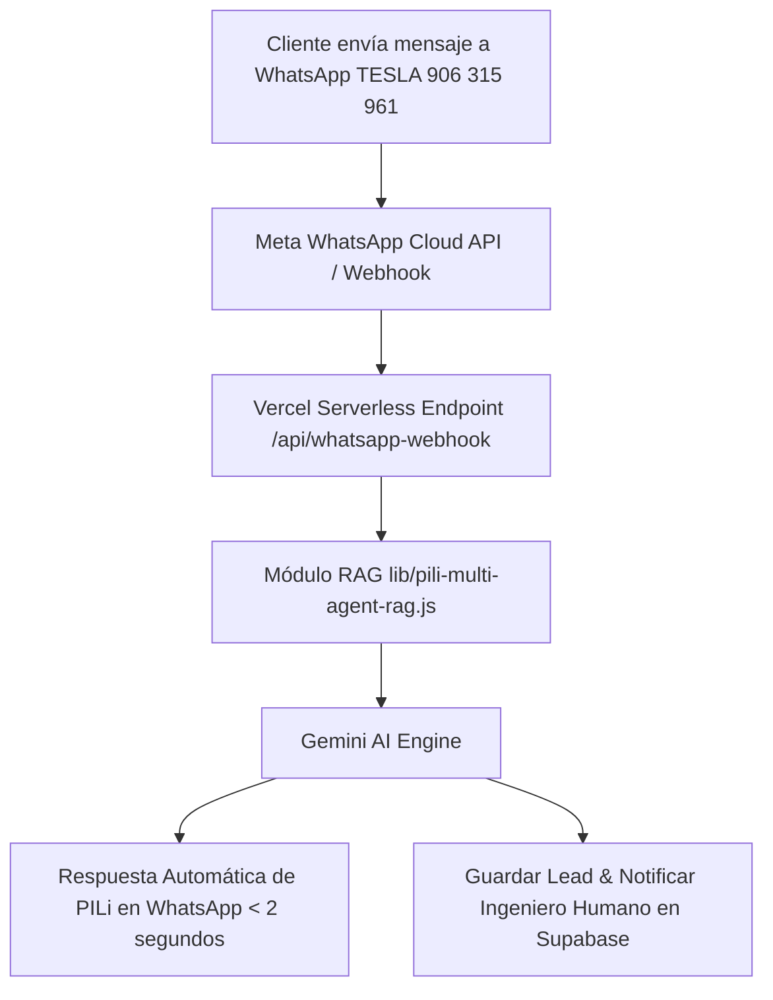

# 📲 Arquitectura de Integración: PILi Multi-Agente en WhatsApp Business

## 1. Visión General
Esta propuesta permite extender la inteligencia de **PILi y sus 8 Agentes Especialistas RAG** desde la Landing Web directamente a **WhatsApp Business**, creando una experiencia omnicanal donde PILi saluda, responde dudas técnicas y agenda citas por WhatsApp.

---

## 2. Nivel 1: Enlace Inteligente Web ➡️ WhatsApp (Paso Inmediato)
Cuando el usuario hace clic en el botón de WhatsApp en la Web (o en la tarjeta del chatbot), el mensaje pre-cargado lleva el contexto exacto del Agente y Servicio consultado:

> *"¡Hola TESLA! Vengo de la web y estuve conversando con [📐 PILi - Especialista BIM / MEP 3D]. Me gustaría agendar una evaluación técnica para mi proyecto."*

---

## 3. Nivel 2: Integración Automática de PILi en WhatsApp (Webhook API)

### Componentes Clave:
1. **Meta WhatsApp Cloud API:** Conexión oficial de Meta (gratuita para los primeros 1,000 chats mensuales).
2. **Endpoint Webhook (`/api/whatsapp-webhook.js`):** Recibe los mensajes en tiempo real, invoca el módulo `pili-multi-agent-rag.js` y envía la respuesta del especialista activo.
3. **Escalamiento a Humano:** Cuando el cliente confirma su Nombre y Ubicación para la cita presencial, PILi envía una notificación al teléfono del Ingeniero Humano de TESLA para tomar la conversación.
